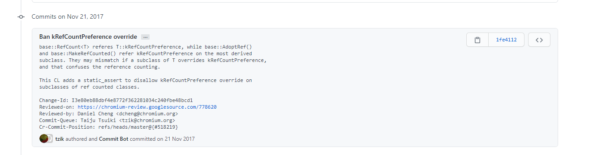

chromium-base库作为业界标杆实现，值得每一位开发者细细品读。
本系列将围绕“基本概念、设计哲学、代码技巧”三个关键点来对chromium-base库进行深度剖析，本篇拆解“智能指针”。

<!--more-->

# chromium-base库源码解读之智能指针篇

chromium-base库封装了一个智能指针类，专门为引用计数`RefCounted<T>`的子类服务。如此我们在使用引用计数对象的时候就无需手动进行`AddRef/Release`操作，对它们的调用封装在了智能指针类，如此就避免了常见的内存泄漏。

文档的注释实际上给出了智能指针的使用方法，首先我们先根据《chromium-base库源码解读之引用计数篇》的`RefCounted<T>`定义一个自定义类：

```cpp
class MyFoo : public RefCounted<MyFoo> {
  ...
  private:
    friend class RefCounted<MyFoo>;	// Allow destruction by RefCounted<>.
     ~MyFoo();                      // Destructor must be private/protected.
};
```

使用时，则类似C++标准库的`make_shared<T>`，可以使用`MakeRefCounted<T>`来创建一个指向`T`对象的智能指针`scoped_refptr<T>`：

```cpp
void some_function() {
  scoped_refptr<MyFoo> foo = MakeRefCounted<MyFoo>();
  foo->Method(param);
  // |foo| is released when this function returns
  // 局部对象`foo`随着函数声明期结束而被自动释放，析构时其指向的对象也会被释放掉。
}
```

七七八八的用法：

```cpp
void some_other_function() {
  scoped_refptr<MyFoo> foo = MakeRefCounted<MyFoo>();
  ...
  foo.reset();  // explicitly releases |foo|
  ...
  if (foo)
    foo->Method(param);
}

{
  scoped_refptr<MyFoo> a = MakeRefCounted<MyFoo>();
  scoped_refptr<MyFoo> b;

  b.swap(a);
  // now, |b| references the MyFoo object, and |a| references nullptr.
}

{
  scoped_refptr<MyFoo> a = MakeRefCounted<MyFoo>();
  scoped_refptr<MyFoo> b;

  b = a;
  // now, |a| and |b| each own a reference to the same MyFoo object.
}
```

## `scoped_refptr<T>`

我们来看看`scoped_refptr<T>`的定义：

```cpp
template <class T>
class scoped_refptr {
 public:
  typedef T element_type;

  constexpr scoped_refptr() = default;

  // Allow implicit construction from nullptr.
  // 指针类为了兼容nullptr都会有这么个支持隐式转换的构造器（nullptr的类型是std::nullptr_t）
  // 有了这个东西，你才能在外部方便的书写smart_ptr == nullptr之类的语句，而不用每次都smart_ptr.get()
  constexpr scoped_refptr(std::nullptr_t) {}

  // Constructs from a raw pointer. Note that this constructor allows implicit
  // conversion from T* to scoped_refptr<T> which is strongly discouraged. If
  // you are creating a new ref-counted object please use
  // base::MakeRefCounted<T>() or base::WrapRefCounted<T>(). Otherwise you
  // should move or copy construct from an existing scoped_refptr<T> to the
  // ref-counted object.
  // 这里为什么不推荐这一构造器去创建智能指针对象呢？
  // 因为你传一个raw pointer进来，尽管生命期维护起来了，但是raw pointer在外部依然是暴露的
  // 一旦外面不小心delete，bug就来了（当然，T的析构器一般是private权限，所以无法delete）
  // 
  // 拷贝[转换]构造器也会用到
  scoped_refptr(T* p) : ptr_(p) {
    if (ptr_)
      AddRef(ptr_);
  }

  // Copy constructor. This is required in addition to the copy conversion
  // constructor below.
  // 下面的构造器是个类内函数模板，它会导致默认的拷贝构造器不会被编译器生成，所以要自己定义
  scoped_refptr(const scoped_refptr& r) : scoped_refptr(r.ptr_) {}

  // Copy conversion constructor.
  // 提供了可转换的不同指针类型对象的“拷贝构造器”（父类指针指向子类对象场景）
  template <typename U,
            typename = typename std::enable_if<
                std::is_convertible<U*, T*>::value>::type>
  scoped_refptr(const scoped_refptr<U>& r) : scoped_refptr(r.ptr_) {}

  // Move constructor. This is required in addition to the move conversion
  // constructor below.
  // 移动构造器，要记得把r.ptr_置空
  scoped_refptr(scoped_refptr&& r) noexcept : ptr_(r.ptr_) { r.ptr_ = nullptr; }

  // Move conversion constructor.
  template <typename U,
            typename = typename std::enable_if<
                std::is_convertible<U*, T*>::value>::type>
  scoped_refptr(scoped_refptr<U>&& r) noexcept : ptr_(r.ptr_) {
    r.ptr_ = nullptr;
  }

  ~scoped_refptr() {
    // 这里其实挺奇怪的，见下文
    static_assert(!base::subtle::IsRefCountPreferenceOverridden(
                      static_cast<T*>(nullptr), static_cast<T*>(nullptr)),
                  "It's unsafe to override the ref count preference."
                  " Please remove REQUIRE_ADOPTION_FOR_REFCOUNTED_TYPE"
                  " from subclasses.");
    if (ptr_)
      Release(ptr_);
  }

  T* get() const { return ptr_; }

  T& operator*() const {
    return *ptr_;
  }

  T* operator->() const {
    return ptr_;
  }

  scoped_refptr& operator=(std::nullptr_t) {
    reset();
    return *this;
  }

  scoped_refptr& operator=(T* p) { return *this = scoped_refptr(p); }

  // Unified assignment operator.
  // 注意这里是值传递，swap后r再返回时触发析构（old对象触发Release）
  // 不会影响实参
  scoped_refptr& operator=(scoped_refptr r) noexcept {
    swap(r);
    return *this;
  }

  // Sets managed object to null and releases reference to the previous managed
  // object, if it existed.
  // 构造一个临时对象交换，简洁便利>>额外开销的场合，这么写很舒服
  void reset() { scoped_refptr().swap(*this); }

  void swap(scoped_refptr& r) noexcept { std::swap(ptr_, r.ptr_); }

  explicit operator bool() const { return ptr_ != nullptr; }

  template <typename U>
  bool operator==(const scoped_refptr<U>& rhs) const {
    return ptr_ == rhs.get();
  }

  template <typename U>
  bool operator!=(const scoped_refptr<U>& rhs) const {
    return !operator==(rhs);
  }

  // ？？？意义不明
  template <typename U>
  bool operator<(const scoped_refptr<U>& rhs) const {
    return ptr_ < rhs.get();
  }

 protected:
  // 原生指针不能对外暴露，所以要protected/private
  T* ptr_ = nullptr;

 private:
  // 该友元函数可以从U对象adopt引用，生成对应的智能指针对象
  template <typename U>
  friend scoped_refptr<U> base::AdoptRef(U*);
  friend class ::base::SequencedTaskRunner;

  // Friend access so these classes can use the constructor below as part of a
  // binary size optimization.
  friend class ::base::internal::BasePromise;
  friend class ::base::WrappedPromise;

  // Returns the owned pointer (if any), releasing ownership to the caller. The
  // caller is responsible for managing the lifetime of the reference.
  T* release();

  // 第二个参数是个标志性质的枚举类型，用以区分public构造器scoped_refptr(T* p)
  // 由于是adopt引用，所以已经AddRef过了，无需再次调用
  scoped_refptr(T* p, base::subtle::AdoptRefTag) : ptr_(p) {}

  // Friend required for move constructors that set r.ptr_ to null.
  // 注意在模板的世界里，scoped_refptr<T>和scoped_refptr<U>代表着两个截然不同的类型
  // 移动构造器里访问了其他类型的非public成员自然需要友元声明
  template <typename U>
  friend class scoped_refptr;

  // Non-inline helpers to allow:
  //     class Opaque;
  //     extern template class scoped_refptr<Opaque>;
  // Otherwise the compiler will complain that Opaque is an incomplete type.
  // ？？？非inline为啥会绕过我不太懂
  static void AddRef(T* ptr);
  static void Release(T* ptr);
};

// 智能指针不再维护T对象的生命周期，返回原生指针给调用者，后续调用者自己维护
template <typename T>
T* scoped_refptr<T>::release() {
  T* ptr = ptr_;
  ptr_ = nullptr;
  return ptr;
}

// static
template <typename T>
void scoped_refptr<T>::AddRef(T* ptr) {
  ptr->AddRef();
}

// static
template <typename T>
void scoped_refptr<T>::Release(T* ptr) {
  ptr->Release();
}

```

构造器`scoped_refptr(T* p)`是个public且支持`T*`的隐式转换，虽然这提供了智能指针与原生指针相互操作的便利性，但是也容易因误用而引起bug。

> 如果是我实现，可能会更倾向于private权限&explicit限定。

除了定义在类内的一些操作符，还有一些是需要在定义在类外的：

```cpp
template <typename T, typename U>
bool operator==(const scoped_refptr<T>& lhs, const U* rhs) {
  return lhs.get() == rhs;
}

template <typename T, typename U>
bool operator==(const T* lhs, const scoped_refptr<U>& rhs) {
  return lhs == rhs.get();
}

template <typename T>
bool operator==(const scoped_refptr<T>& lhs, std::nullptr_t null) {
  return !static_cast<bool>(lhs);
}

template <typename T>
bool operator==(std::nullptr_t null, const scoped_refptr<T>& rhs) {
  return !static_cast<bool>(rhs);
}

template <typename T, typename U>
bool operator!=(const scoped_refptr<T>& lhs, const U* rhs) {
  return !operator==(lhs, rhs);
}

template <typename T, typename U>
bool operator!=(const T* lhs, const scoped_refptr<U>& rhs) {
  return !operator==(lhs, rhs);
}

template <typename T>
bool operator!=(const scoped_refptr<T>& lhs, std::nullptr_t null) {
  return !operator==(lhs, null);
}

template <typename T>
bool operator!=(std::nullptr_t null, const scoped_refptr<T>& rhs) {
  return !operator==(null, rhs);
}

template <typename T>
std::ostream& operator<<(std::ostream& out, const scoped_refptr<T>& p) {
  return out << p.get();
}
```

以及支持类外的swap操作（二元操作）：

```cpp
template <typename T>
void swap(scoped_refptr<T>& lhs, scoped_refptr<T>& rhs) noexcept {
  lhs.swap(rhs);
}
```

### 析构器的`static_assert`

注意到上面析构器里有个奇怪的static_assert，根据其字符串描述看起来是不希望`scoped_refptr`与`REQUIRE_ADOPTION_FOR_REFCOUNTED_TYPE`子类的overridden共用。但实际上展开看`IsRefCountPreferenceOverridden`的定义来看：

```cpp
template <typename T, typename U, typename V>
constexpr bool IsRefCountPreferenceOverridden(const T*,
                                              const RefCounted<U, V>*) {
  return !std::is_same<std::decay_t<decltype(T::kRefCountPreference)>,
                       std::decay_t<decltype(U::kRefCountPreference)>>::value;
}

template <typename T, typename U, typename V>
constexpr bool IsRefCountPreferenceOverridden(
    const T*,
    const RefCountedThreadSafe<U, V>*) {
  return !std::is_same<std::decay_t<decltype(T::kRefCountPreference)>,
                       std::decay_t<decltype(U::kRefCountPreference)>>::value;
}

constexpr bool IsRefCountPreferenceOverridden(...) {
  return false;
}

...
    
 static_assert(!base::subtle::IsRefCountPreferenceOverridden(
                      static_cast<T*>(nullptr), static_cast<T*>(nullptr)),
                  "It's unsafe to override the ref count preference."
                  " Please remove REQUIRE_ADOPTION_FOR_REFCOUNTED_TYPE"
                  " from subclasses.");
```

这里的编译断言会优先匹配前两个（根据是否使用线程安全版本的基类），而这里对型别的判定，二者实际上取出来的都是subclass里定义的`kRefCountPreference`，所以肯定会返回`false`。

我查了一下这个文件的commit log，作者是这样写的：



>  TODO: 我会问问作者，这段代码的用途具体是怎样的。


### `MakeRefCounted`

类似标准库的`make_shared`，智能指针对象一般通过该函数来从零创建：

```cpp
// Constructs an instance of T, which is a ref counted type, and wraps the
// object into a scoped_refptr<T>.
template <typename T, typename... Args>
scoped_refptr<T> MakeRefCounted(Args&&... args) {
  T* obj = new T(std::forward<Args>(args)...);
  return subtle::AdoptRefIfNeeded(obj, T::kRefCountPreference);
}

namespace subtle {
template <typename T>
scoped_refptr<T> AdoptRefIfNeeded(T* obj, StartRefCountFromZeroTag) {
  return scoped_refptr<T>(obj);
}

template <typename T>
scoped_refptr<T> AdoptRefIfNeeded(T* obj, StartRefCountFromOneTag) {
  return AdoptRef(obj);
}

} // namespace subtle
```

通过模板参数包的完美转发传递到匹配的`T`构造器，然后根据`T::kRefCountPreference`来选择合适的重载函数：对于`StartRefCountFromOneTag`来说，通过`AdoptRef`来中转一下，保证引用计数的正确性；对于`StartRefCountFromZeroTag`，则直接调用接受`T*`参数的构造器。

#### 友元函数`scoped_refptr<U> base::AdoptRef(U*)`

再看看友元函数如何adopt引用：

```cpp
// Creates a scoped_refptr from a raw pointer without incrementing the reference
// count. Use this only for a newly created object whose reference count starts
// from 1 instead of 0.
template <typename T>
scoped_refptr<T> AdoptRef(T* obj) {
  using Tag = std::decay_t<decltype(T::kRefCountPreference)>;
  // 这里保证了自定义类声明了REQUIRE_ADOPTION_FOR_REFCOUNTED_TYPE
  static_assert(std::is_same<subtle::StartRefCountFromOneTag, Tag>::value,
                "Use AdoptRef only if the reference count starts from one.");

  // 这里使用private构造器
  return scoped_refptr<T>(obj, subtle::kAdoptRefTag);
}
```

### `WrapRefCounted`

除了自主产生`T`对象的`MakeRefCounted<T>`以外，有些时候我们还是会需要基于原生指针来创建智能指针，虽然可以直接写作`scoped_refptr<T>(ptr)`，但终归不够表意，于是就有了`WrapRefCounted`：

```cpp
// Takes an instance of T, which is a ref counted type, and wraps the object
// into a scoped_refptr<T>.
template <typename T>
scoped_refptr<T> WrapRefCounted(T* t) {
  return scoped_refptr<T>(t);
}
```

使用时要注意不要再`delete t`，尤其是自定义类的析构器权限为public时。